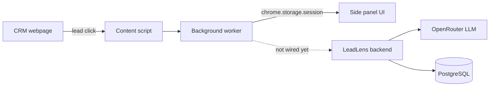

# LeadBrief (AI CRM Copilot)

A Chrome extension that gives sales agents a one-page AI briefing on a lead before a meeting —
instead of digging through CRM fields, call notes, and WhatsApp threads by hand.

**Status: 2-day hackathon build.** CRM/lead detection is real and working; the briefing panel
itself still shows mock data — it isn't wired to the backend yet.

## Architecture



## What works

- Detects which CRM is open (`leadrat.com`, `leadrat-builder`, or falls back to unknown)
- Detects the lead being viewed — a DOM click, or a network request for leadrat-builder
- Shows a "Detected lead" banner in the side panel, independent of the mock-data toggle

## What's not wired up yet

- The extension never calls the backend — a detected lead is only logged to the console
- The briefing panel always shows hardcoded mock data
- No auth is sent yet from the extension (the backend already supports a bearer token)
- LeadRat proper (`*.leadrat.com`) has no working lead detection yet

## Run it

**Extension:**

```bash
cd frontend/leadlens
npm run dev:extension
```

Load `frontend/leadlens/build` as an unpacked extension via `chrome://extensions`.

**Backend** (not called by the extension yet, but a real API):

```bash
cd backend/leadlens
./mvnw spring-boot:run
```

## Tests

```bash
make verify
```

Integration tests need Docker (they use a real Postgres via Testcontainers) and skip cleanly
without it locally — CI requires Docker and fails instead of skipping.

## Production cost

**Not deployed to production yet** — this is a hackathon project. If it were:

- The extension itself costs nothing — it runs entirely in the user's browser.
- The backend would need simple hosting, similar in shape to `leads-crm-backend` (~$30/month),
  plus LLM usage cost — see below.

## Token usage

The backend calls an LLM (OpenRouter) to write each briefing. To keep that cheap:

- Only pull in the facts actually needed for a briefing — don't dump the full lead history into
  the prompt.
- Prefer a smaller, cheaper model for routine briefings; save bigger models for hard cases.
- Cache a generated briefing instead of regenerating it every time the panel opens.

## Gotchas worth knowing

- `chrome.storage.session` clears every time the extension reloads — reload before clicking a
  lead when testing, not after.
- Chrome's per-site permission toggle can silently block `chrome.webRequest` even when the
  manifest is correct — check "This can read and change site data" if detection stops working.
- MV3 service workers terminate after ~30s idle, and their console history doesn't survive that.

## Where to read more

See `IMPLEMENTATION_PLAN.md` for the full design and phase-by-phase detail.
