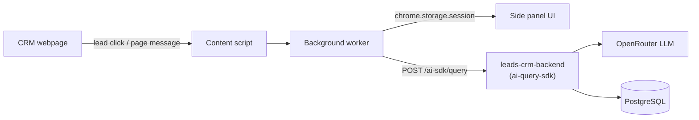

# LeadBrief (AI CRM Copilot)

A Chrome extension that gives sales agents a one-paragraph AI briefing on a lead before a
meeting — instead of digging through CRM fields, notes, and WhatsApp threads by hand.

**Status: 2-day hackathon build, extension only — no backend of its own.** It calls
`leads-crm-backend`'s embedded `ai-query-sdk` directly for the briefing.

## Architecture

## What works

- Detects which CRM is open — `leads-crm-frontend`, `leadrat.com`, `leadrat-builder`, or unknown
- Detects the lead being viewed — page message, DOM click, or a network request, depending on CRM
- Side panel calls the SDK directly and shows a real AI-written paragraph about that lead —
  never mock data once wired up

## Known trade-offs (read before shipping this anywhere real)

- **The SDK admin password ships inside the extension bundle** — anyone who installs it can pull
  it out and call the SDK as admin. Fine for a private demo, not for production.
- **No tenant check before a lead ID reaches the SDK** — any detected lead ID goes straight
  through, with nothing verifying the viewer actually has access to it.
- No per-claim citations, no structured Objections/Talking Points sections, nothing persisted —
  every panel open is a fresh AI call. See git history for the fuller list of what an earlier,
  removed backend used to provide.

## Run it

| # | Service | Command |
|---|---|---|
| 1 | `leads-crm-backend` | set `AI_SDK_ADMIN_PASSWORD` in `.env`, then `docker compose up -d && ./mvnw spring-boot:run` |
| 2 | Provision the SDK once | `AI_SDK_ADMIN_PASSWORD=... ../leads-crm-backend/scripts/provision-ai-sdk.sh` |
| 3 | `leads-crm-frontend` | `npm run dev` |
| 4 | Extension | `cd leadlens && cp .env.example .env` (fill in `VITE_AI_SDK_ADMIN_PASSWORD`), then `npm run dev:extension` |

Load `leadlens/build` as an unpacked extension via `chrome://extensions`.

## Production cost

**Not deployed to production** — this is a hackathon project. If it were, it would ride on
`leads-crm-backend`'s hosting (~$30/month, see that repo's README) since it has no infrastructure
of its own — plus LLM usage cost below.

## Token usage

Every briefing is one `/ai-sdk/query` call, billed per token by OpenRouter. To keep it cheap:

- Keep the query's traversal depth small — don't pull in more of the lead's related data than a
  one-paragraph summary actually needs.
- Cache a generated briefing per lead instead of recomputing it on every panel open (nothing is
  cached today — every open is a fresh, billed call).
- Use a cheaper model for this use case; a short summary doesn't need the strongest model available.

## Gotchas worth knowing

- `chrome.storage.session` clears on every extension reload — reload before clicking a lead when
  testing, not after.
- Chrome's per-site permission toggle can silently block `chrome.webRequest` even when the
  manifest is correct.
- MV3 service workers terminate after ~30s idle, and console history doesn't survive that.

## Where to read more

See `IMPLEMENTATION_PLAN.md` for the original design, and git history for how the backend was
removed in favor of calling `leads-crm-backend`'s SDK directly.
